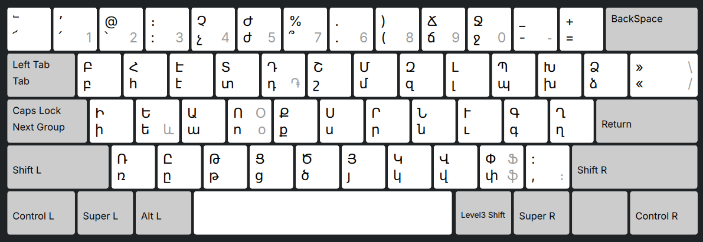
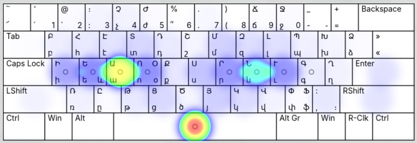
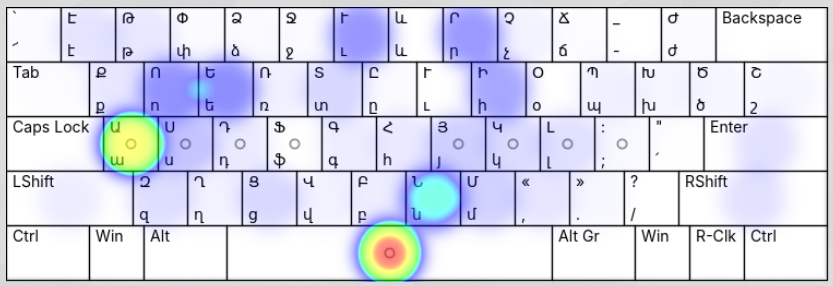
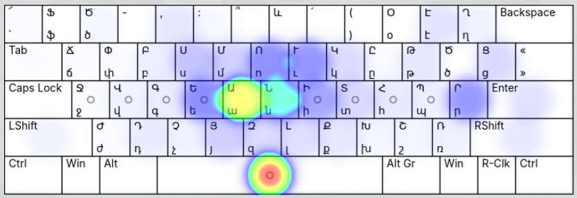
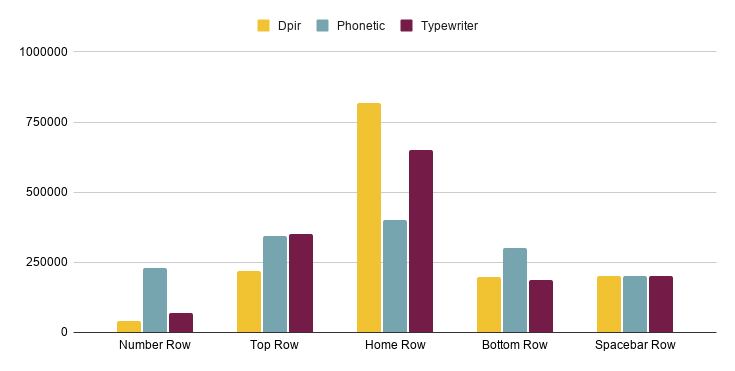
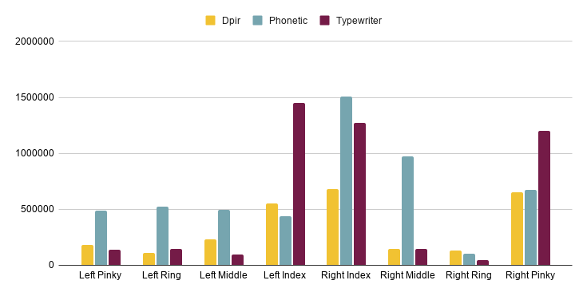
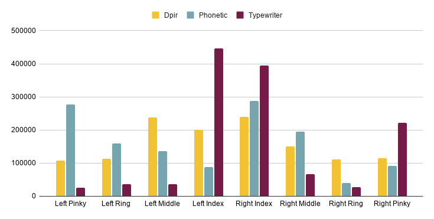

Read in: [English](#en) | [Հայերէն](#xcl) 



**ՈՒՇԱԴՐՈՒԹԻՒՆ**
Այս գործս անաւարտ իցէ: Է տեղի բարելաւմանց, առաւել յաջող բաշխման ստեղանց, այղ սա է լաւագոյն տարբերակ զոր այսաւր ունիմք:
Ազատ զգա առաջարկել փոփոխութիւնս թե նկատես խնդիրս:

**ATTENTION**
This is an early version. There's some room for the improvement by key rearrangement, and this is the best one we currently have. Feel free to suggest changes if you notice something being off.

<div id="xcl"></div>

# ԴՊԻՐ

### Բովանդակութիւն
* [Նպատակ](#xcl-why)
* [Ուստի՞ անունն](#xcl-name)
* [Մաւտեցմունք առ նախագծումն](#xcl-dp)
* [Վերլուծութիւն](#xcl-analytics)
* [Փորձարկել եւ ներբեռնել](#xcl-install)

<div id="xcl-why"></div>

## Նպատակ

Այս է նախագիծ միտեալ առ ստեղծումն նորոյ ստեղնաշարի վասն լեզուի հայոց: 

Այսաւր են երկու հայերէն ստեղնաշարք՝ հնչիւնաբանական ընդ այղեւայղ յարմարեցմամբ վասն արեւելեան եւ արեւմտեան աշխարհաբարից որ է աղաւաղեալ տաբերակ անգղիարէն QWERTY շարուածոց, եւ տպագրական, որ թե պէտ առաւել բարի է քան հնչիւնաբանական, եւս չէ յարմար:  

Վասն որոյ ստեղծանեմք զնոր շարուածս որ հիմնին ի վերայ յաճախականութեան տառուց ի [dzainacoit](https://github.com/nk-oruj/dzainacoit/)-է ստեղցելոյ [@nk-oruj](https://github.com/nk-oruj)-ի եւ յարմարեցեալ են վասն լաւագոյն փորձից տպման:  

<div id="xcl-name"></div>

## Ուստի՞ անունն

Դպիր ոչ լոկ նոտար կամ scholar նշանակէ, այղ նա եւ խելացի / գրագէտ: Նա եւ, իբրեւ ոք արեւմտահայերէն ասէ «դպի՛ր», հրամայէ տպել:

<div id="xcl-dp"></div>

## Մաւտեցմունք առ նախագծումն 

### Շարք ստեղանց

Մին ի նպատանաց այսց շարուածոց էր զբաղեցուցանել զնուազագոյն թիւ ստեղանց, առ յապահովել զյարմարութիւն, որպէս եւ զտեղի ունել վասն կիտադրական նշանաց: Backslash չգործածի զի երկար ձգումն իցէ վասն աջ ճկոյթի: Եւ զի յաճախագոյն կիտադրական նշանք՝ ստորակէտ եւ վերջակէտ հեշտ հասանելի լիցին, ընտրեալ եմք զ-Slash ստեղնն, նմանեալ ЙЦУКЕН շարուածոց ռուսաց: Երեք տառք որք չէին մասն սկզբնական այբուբէնի Մաշտոցի` և, Օ եւ Ֆ փոխադրեալ են յերրորդ շերտն: Արտաքս երից գլխաւոր շարաց ստեղնաշարի են չորք ստեղանք ի շարս թուոց` 4-5 եւ 9-0 զի ամենահասանելիք են, եւ անդ տեղակային սակաւագոյն գործածեալ տառինք` Չ, Ժ, Ճ, Ջ:

### Կիտադրութիւն

Հանուրք կիտադրական նշանք առկայ են յայս շարուածս, նոյնիսն «Պատիւ նշանն»(՟) գտաւ զտեղի իւր:

**ՈՒՇԱԴՐՈՒԹԻՒՆ**: Վերջակէտ, ենթամնայ եւ միջակէտ նշանք յառաջնում շերտի են սովորական comma, dash եւ colon նշանք Unicode-ի, այղ ՈՉ ՀԱՅԿԱԿԱՆ ՏԱՐԲԵՐԱԿՔ: Վասն դոցինց պարտ է սեղմել `AltGr + ,(/)` կամ `AltGr + :(3)` վասն վերջակիտոյ: `AltGr + -` վասն ենթամնայի եւ `Shift + .(7)` վասն միջակիտոյ:

Վասն զի ոչ ամենեցունց կարէր `Shift + ,(/)` յարմար լինել վասն վերջակիտոյ, որոշեալ եմք կրկնաւրինակել այն ի տեղւոջ 3 ստեղան: Սակայն, այս մասն **ԱՆԱՒԱՐՏ ԻՑԷ**, եւ ուրախ եղիցուք առաջարկաց քոց:

### Երրորդ շերտ

Այս շարուածք լայնաւրէն գործածեն զերրորդ շերտ նշանաց, որ հասանելի է AltGr ստեղամբ (աջ Alt): Վասն զի շարք թուոց զբաղեցեալ է կիտադրական նշանաւք եւ տառիւք, բուն թիւք հասանելի են յերրորդ շերտի սեղմամբ `AltGR + {Թիւ}`-ի:

Since the number row is occupied with letters and diacritics, the numbers are accessible at the third layer, by simply pressing `AltGr + {Number}`. Սեղմամբ `AltGr + Ո`, `AltGr + Ե`, `AltGr + Փ`-ոց բանան Օ, և եւ Ֆ տառք: Իսկ `AltGr + Դ` տայ զնշան Դրամի Հայոց (֏):

<div id="xcl-analytics"></div>

## Վերլուծութիւն

Առ ի փորձարկել զարդիւնաւէտութիւն նորոց շարուածոց գործածեալ եմք զ-[Keyboard Layout Analyzer](https://patorjk.com/keyboard-layout-analyzer/) որ ստեղծեալ է ձերամբ [PatorJK](https://patorjk.com/)-ի: Վերլուծեալ մարմին գրականութեան է հաւաքածոյ բազմանց գրոց դասական լեզուաւ հայոց որ բաղկանայ ի 1446909 նշանաց եւ 217409 բառուց: Մեր Դպիր շարուածք համեմատեալ են ընդ հնչիւնաբանական եւ տպագրական շարուածոց:

### Քարտես տաքութեան

Սոքա են քարտեսք տաքութեանց շարուածոց:

#### Դպիր



#### Հնչիւնաբանական



#### Տպագրական



### Գործածումն շարոց

Որպէս կարես տեսանել, Դպիր շարուածք գործածէ զգլխաւոր շարս առաւել քան զայղ շարս, մինչ այղ շարուածք կաղեն:



### Քանակ շարժման մատանց

Քանակ տեղափոխութեանց զոր ամէն մատ պարտի առնել կարի նուազեալ է համեմատեալ այղոց շարուածոց:



### Գործածումն մատանց

Քանակ գործածման ամէն մատան եւս հաւասարակշռեալ է:



<div id="xcl-install"></div>

## Փորձել եւ ներբեռնել 

Զոր ինչ ստեղծեալ եմք փորձարկելի է այսու յղմամբ.

> https://ditsak.github.io/dpir/sandbox.html

### Linux

Վասն ներբեռնելոյ առ զվերջին dpir_for_linux.tar.gz փաթեթ, բաց այն եւ կատարիր զայս հրաման.

```bash
sudo ./install_dpir.sh
```

Ապա

Եթե գծապատկերային միջերես է, գտիր զ-`Armenian(Dpir)` տարբերակն ի կարգաւորմունս:
Եթե հրամանային է, գործածիր զսա ընդ այղոց կարգաւորմանց քոց.

```bash
setxkbmap -layout am -variant Dpir
```

### Windows

Առ զվերջին `dpir_for_windows.zip` փաթեթ, բաց այն եւ գործարկիր զ-`setup.exe`, յետ որոյ յընտրութեան լեզուաց գտցես զ-`Armenian Dpir Layout` տարբերակն:

### Mac
Առ այժմ չէ ստեղծեալ փաթեթք վասն Mac-ի:

---

<div id="en"></div>

# DPIR

### Table of Contents
* [Goal](#en-why)
* [The name?](#en-name)
* [Design Principles](#en-dp)
* [Analytics](#en-analytics)
* [Try and Install](#en-install)

<div id="en-why"></div>

## Goal

This is a project aimed at creating a brand new keyboard layout for the Armenian language.  

Currently there are two Armenian keyboard layouts: phonetic with its variations for western and eastern Armenians which is a distorted adaptation of the English QWERTY layout, and the other one is the typewriter layout, which even though is much better than the phonetic, it's still not great.  

Hence we decided to create a new one based on the letter frequencies from the repo of [dzainacoit](https://github.com/nk-oruj/dzainacoit/) made by [@nk-oruj](https://github.com/nk-oruj) and aiming for the best typing experience.  

<div id="en-name"></div>

## The name?

What does "Dpir" stand for? Dpir means a scholar, meanwhile it also carries the meaning of "smart". And besides that, if someone speaking Western Armenian said "Dpir!", it would mean "Type!", commanding to type.

<div id="en-dp"></div>

## Design Principles

### Key range

One of the goals of this layout was to use as few keys as possible, in order to be able to have comfortable reach for each letter, as well as have space for the diacritics. The backslash was decided to not be used for a letter, because it would be a big stretch for the right pinky. And to make the most common diacritics (the comma and fullstop) comfortably accessible, the slash key was preserved for that, similar to how it's handled in the Russian ЙЦУКЕН layout. The three letters that were not part of the original alphabet, the և, Օ and Ֆ were moved to the third layer. Outside of the main three rows, there are 4 keys on the number row used for letters. It was chosen to take the 4-5 and 9-0, since these are the easiest ones to reach, and to balance things out, the least frequently used keys were sent to that row.

### Diacritics

All of the diacritic signs used in Armenian are present on this layout, even the "Pativ Nshan"(՟).

**WARNING**: The fullstop, entamna and period symbols on the first level are the regular comma, dash and colon from the Unicode. To get the Armenian versions of those, press `AltGr + ,(/)` or `AltGr + :(3)` for the fullstop, `AltGr + -` for the entamna and `Shift + .(7)` for the period. 

Since it might not be comfortable for everyone to press `Shift + ,`(/) in order to get the fullstop, it was decided to replicate it on the key 3. Though, this one is **WORK IN PROGRESS**, we're open to your suggestions.

### Third layer

This layout emphasizes the usage of the third layer, accessed by the AltGr key (right Alt). Since the number row is occupied with letters and diacritics, the numbers are accessible at the third layer, by simply pressing `AltGr + {Number}`. By pressing `AltGr + Ո`, `AltGr + Ե`, `AltGr + Փ` the Օ, և and Ֆ letters can be accessed. And by pressing `AltGr + Դ` one can access the Armenian Dram sign (֏).

<div id="en-analytics"></div>

## Analytics

To test the efficiency of the new layout, we used the [Keyboard Layout Analyzer](https://patorjk.com/keyboard-layout-analyzer/) made by [PatorJK](https://patorjk.com/). The text that was analyzed was a composition of many classical Armenian texts consisting of 1446909 characters and 217409 words. Our Dpir layout was compared against the Armenian phonetic and typewriter layouts.

### Heatmaps

Here you can see the heatmaps of each of the layouts:

#### Dpir


#### Phonetic


#### Typewriter


### Row usage

As you can see, the Dpir layout heavily utilizes the home row, while the other layouts are weak on that. Also the usage of the number row is the lowest among the three.


### Finger travel distance

The distance that each finger has to travel has been dramatically cut compared to the typewriter, and especially to the phonetic layout.


### Finger usage

The amount of usage of each finger has been balanced out too and it's more stable.


<div id="en-install"></div>

## Try and Install

You can try it out in the sandbox by the link below

> https://ditsak.github.io/dpir/sandbox.html

### Linux

To install, download the latest package, untar the archive and execute the following command:

```bash
sudo ./install_dpir.sh
```

If you use GUI, go to the settings and find the new `Armenian(Dpir)` option.
If you use CLI, set it via this command combined with your other options for `setxkbmap`:

```bash
setxkbmap -layout am -variant Dpir
```

### Windows

Get the latest `dpir_for_windows.zip` archive from the releases section, unzip it, and run the `setup.exe`, after which in the language selection section of the settings you'll find `Armenian Dpir Layout`.

### Mac
Currently we haven't made the packages for Mac due to not having one, but sometime soon this gap will be filled. Stand by
